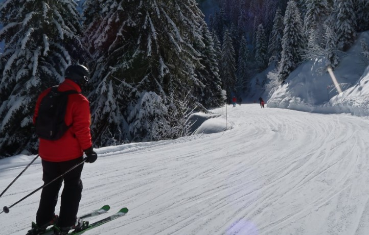
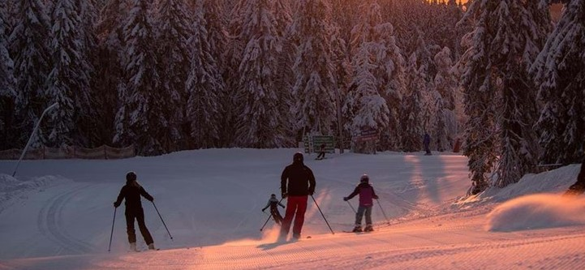

I landskapet Dalarna erbjuder skidåkning på ett flertal ställen under vinter/vår. 
    Här kan man ta in på hotell eller hyra en stuga. Man kan ta med egen utrustning eller hyra. 
    Det är en rolig aktivitet både för vuxna och barn. Den som inte lärt sig åka kan hålla sig i barnbacken eller anmäla sig till en skidskola som kan lära ut hur man åker skidor. 
    Ta en paus i en solig grop någonstans och ha med varm choklad och mackor. 
    Eller kör en avslappnande afterski efter en hel dag i backen. 

För den som inte gillar utförsåkning finns alternativet längdskidor, skotersafari eller varför inte testa hundspann? På kvällstid finns det restauranger man kan besöka eller andra typer av uteställen.

Här är några utav de ställen som man kan åka till i Dalarna:

### Sälen

Störst är Sälen som har 186 nedfarter och 126 liftar uppdelade på Kläppen, Lindvallen, Högfjället, Tandådalen, Hundfjället och Stöten. De mest barnvänliga områdena är Lindvallen, Kläppen och Högfjället. 
    I Tandådalen och Hundfjället finns blandad skidåkning och i Stöten är det lite brantare backar och vacker utsikt. Är man sugen på att hitta på något mer än vinteraktiviteter ute kan man besöka Experium i Lindvallen där har dom bio, bowling och äventyrsbad.

### Orsa

Nära sjön Siljan ligger Orsa Grönklitt som är mycket barnvänligt. Här finns även Orsa Rovdjurspark som man kan besöka.

### Borlänge

I Borlänge hittar du Romme Alpin som har 33 nedfarter och 14 liftar. Från Stockholm tar det bara 2,5 timme att åka så dit kan man åka upp bara för en dag om man vill.

### Idre

Även i Idre hittar du mycket barnvänliga backar blandat med mer avancerade backar. I Idre fjäll ligger alla boenden väldigt nära backen och har s.k.  ski-in/ski-out så du behöver inte använda bilen för att ta dig till backarna.
